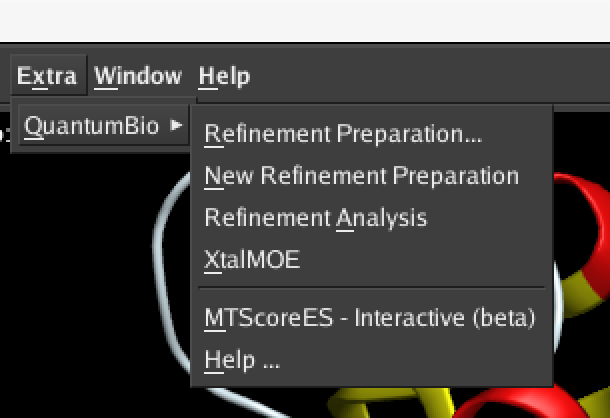

# MOE/DivCon

The MOE/DivCon Scientific Vector Language (SVL) package is a set of support applications which 
allow QuantumBio software to be installed in and used with the MOE and MOE/batch platform from 
[Chemical Computing Group, Inc.](https://www.chemcomp.com/).

The software consists of a self-contained set of SVL applications and scripts and an associated menu 
file which can be installed in a user's home directory using the following steps.

A more detailed set of installation instructions (along with tutorials) can be found on the 
QuantumBio [WebSite](http://www.quantumbioinc.com/resources/manual/installation/).

## The ${HOME}/moefiles directory 

As detailed in the MOE manual, you may install software and plugins such as those provided by 
QuantumBio using the moefiles directory placed in the user's home directory. This is the easiest 
place to install these plugins as the user generally does not need admin privileges to do so.

```
    % mkdir -p ${HOME}/moefiles/svl
    % mkdir -p ${HOME}/moefiles/menu
```

## Checkout and Install the included SVL directory

You are welcome to clone the entirety of the MOE/DivCon source tree at a location of your own choosing. 
We will then create a symbolic link from within the ${HOME}/moefiles/svl to that location.

```
    % cd /path/you/wish/to/install/MOEDivCon
    % git clone --branch GridMarkets https://github.com/quantumbio/MOEDivCon.git MOEDivCon-GridMarkets
    % cd ${HOME}/moefiles/svl
    % ln -s /path/you/wish/to/install/MOEDivCon/MOEDivCon-GridMarkets/svl qb.svl
```

## Install the included QuantumBio Menu

Finally, to easily access the software from within MOE, you should install the QuantumBio menu. 
This menu can be found in the Extra menu on the main MOE window.

```
    % cd ${HOME}/moefiles/menu
    % ln -s /path/you/wish/to/install/MOEDivCon/MOEDivCon-GridMarkets/moe-menus menu-extra-qb
```



